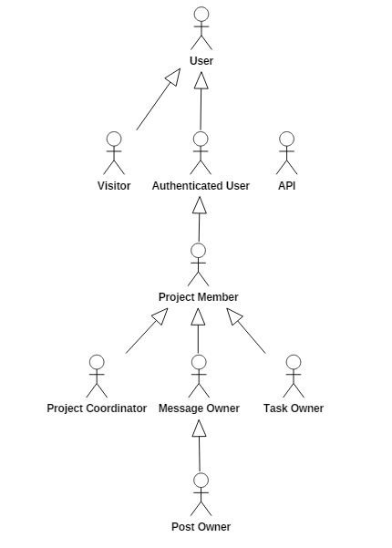

# A2: Actors and User stories
 
## 1. Actors

Figure 1: Actors.

 
Identifier|Description|Examples
----------|-----------|--------
User|Generic user that has access to public information such as public project names and descriptions|N/A
Visitor|Unauthenticated user that has access to public information such as public project names and descriptions. Can register itself (sign-up) or sign-in in the system|N/A
Authenticated User|Authenticated user that has access to public projects, can create and ask to join projects|N/A
Project Member|User that joins a project or is invited by the coordinator of said project. Can add tasks, create forum posts and comment on forum posts|Team members
Project Coordinator|User that creates a project. Can invite, accept join requests and ban users of said project. Has the same permissions of Common user|Team Leader
Task Owner|User that creates a task in a project. Can edit and delete your task. Also receives notifications if a project member pick, finish or give up the task|N/A
Message Owner|User that comments in a forum post. Can edit and delete your comment|N/A
Post Owner|User that creates a forum post. Can edit and delete your post. Also can delete others users' comments|N/A
API|External API that can be used to register or authenticate in the system|Facebook

Table 1: Actor's description 

## 2. User Stories 

### 2.1. Visitor

Identifier|Name|Priority|Description
----------|----|--------|-----------
US01|Sign-In|High|As a Visitor, I want to authenticate into the system, so that I can access privileged information
US02|Sign-up|High|As a Visitor, I want to register myself into the system, so that I can authenticate myself into the system
US03|Sign-in using external API|Low|As a Visitor, I want to sign-in through my Facebook account, so that I can authenticate myself into the system
US04|Sign-up using external API|Low|As a Visitor, I want to register a new account linked to my Facebook account, so that I can access privileged information

Table 2: Visitor's user stories 

### 2.2. User

Identifier|Name|Priority|Description
----------|----|--------|-----------
US11|Home page|High|As an User, I want to access home page, so that I can see a brief website's presentation
US12|About page|High|As an User, I want to access the about page, so that I can see a complete website's description
US13|Projects page|High|As an User, I want to access the projects page, so that I can see all public projects
US14|FAQ page|High|As an User, I want to access the FAQ page, so that I can take off my doubts about the system
US15|Contact page|High|As an User, I want to access contact page, so that I can see the contacts
US16|Search projects|High|As a user, I want to search a project, so that I can find the specific project
US17|Filter projects|Low|As a user, I want to filter projects by project state, so that I can limit my search 

Table 3: User's user stories 

### 2.3. Authenticated User

Identifier|Name|Priority|Description
----------|----|--------|-----------
US21|Sign-Out|High|As an Authenticated User, I want to exit from the system, so that I can end my session
US22|Join a project|High|As an Authenticated User, I want to join a project, so that I can access privileged information
US23|Edit profile|Medium|As an Authenticated User, I want to edit my profile, so that I can keep my profile updated
US24|Respond to project invites|Low|As an Authenticated User, I want to accept/refuse invites to join a project 

Table 4: Authenticated User's user stories 

### 2.4. Project Member
Identifier|Name|Priority|Description
----------|----|--------|-----------
US31|Member List|High|As a Project Member, I want to access the member list, so that I can see the members on project
US32|Create a Task|High|As a Project Member, I want to create tasks, so that I set goals
US33|Pick a Task|High|As a Project Member, I want to pick a task, so that I can do a job in the project
US34|Create a forum posts|High|As a Project Member, I want to create forum posts, so that I start a discussion
US35|Comment on a forum post|High|As a Project Member, I want to comment on the forum posts, so that I can tell other users my opinion

Table 5: Common User's user stories 

### 2.5. Project Coordinator
Identifier|Name|Priority|Description
----------|----|--------|-----------
US41|Invite user|Low|As a Project Coordinator, I want to invite users, so that I can include users on the project
US42|Remove user|Low|As a Project Coordinator, I want to remove users, so that I can keep only actives users on the project
US43|Accept user|Low|As a Project Coordinator, I want to accept users, so that I can include users in the project
US44|Edit project description|Low|As a Project Coordinator, I want to edit project description, so I can adjust the goals of project
US45|Edit project status|Low|As a Project Coordinator, I want to choose between the Concluded/In Progress status for the project
US46|Edit project permissions|Low|As a Project Coordinator, I want to choose between the Public/Private status for the project
US47|Promove as coordinator|Low|As a Project Coordinator, I want to set project members as coordinators, so that I can include others coordinator in the project
US48|Remove Coordinator|Low|As a Project Coordinator, I want to set coordinators as project members, so that I can remove members' privileges

Table 6: Coordinator's user stories

### 2.6. Message Owner
Identifier|Name|Priority|Description
----------|----|--------|-----------
US51|Edit Message|Low|As a Message Owner, I want to edit my message, so that I can change what I wrote
US52|Delete Message|Low|As a Message Owner, I want to delete my message, so that I can remove a wrong comment 

Table 7: Message Owner's user stories

### 2.7. Post Owner
Identifier|Name|Priority|Description
----------|----|--------|-----------
US61|Edit Post|Low|As a Post Owner, I want to edit the post, so that I can change what I wrote
US62|Delete Post|Low|As a Post Owner, I want to delete my post, so that I can remove a wrong post
US63|Delete Post Messages|Low|As a Post Owner, I want to delete users' messages, so that I can remove wrong comments

Table 8: Message Owner's user stories

### 2.8. Task Owner
Identifier|Name|Priority|Description
----------|----|--------|-----------
US71|Edit Task|High|As a Task Owner, I want to edit the task, so that I can set the new goals
US72|Delete Task|High|As a Task Owner, I want to delete my task, so that I can remove a unnecessary task
US73|See Task Notifications|Low|As a Task Owner, I want to see my tasks notifications, so that I can know my tasks status
US74|Task Completion|Low|As a Task Owner, I want to set my task status, so that I can set a task as done

Table 9: Task Owner's user stories
 
## A1. Annex: Supplementary requirements
This annex contains business rules, technical requirements and other non-functional requirements on the project.
 
### A1.1. Business rules
A business rule defines or constrains one aspect of the business, with the intention of asserting business structure or influencing business behaviour.

Identifier|Name|Description 
----------|----|-----------
BR01|Max Users|A project can contain a maximum of 100 users
BR02|Join in a project|A user can only aks to join in unfinished public projects
BR03|User birth date|When creating a profile user's can´t choose a date of birth more than 100 years ago from current time
BR04|Task duration|When creating a task that task duration can't be more than a year

 ### A1.2. Technical requirements
Technical requirements are concerned with the technical aspects that the system must meet, such as performance-related issues, reliability issues and availability issues. 

Identifier|Name|Description 
----------|----|-----------
TR01|Availability|The system must be available 99 percent of the time in each 24-hour period
TR02|Accessibility|The system must ensure that everyone can access the pages, regardless of whether they have any handicap or not, or the Web browser they use
TR03|Usability|The system should be simple and easy to use
TR04|Performance|The system should have response times shorter than 2s to ensure the user's attention
TR05|Web application|The system should be implemented as a Web application with dynamic pages (HTML5, JavaScript, CSS3 and PHP)
TR06|Portability|The server-side system should work across multiple platforms (Linux, Mac OS, etc.)
TR07|Database|The PostgreSQL 9.4 database management system must be used
TR08|Security|The system shall protect information from unauthorised access through the use of an authentication and verification system
TR09|Robustness|The system must be prepared to handle and continue operating when runtime errors occur
TR10|Scalability|The system must be prepared to deal with the growth in the number of users and their actions
TR11|Ethics|The system must respect the ethical principles in software development (for example, the password must be stored encrypted to ensure that only the owner knows it) 
TR12|Legal requiriments|The system must be acording the laws
  
### A1.3. Restrictions
 
A restriction on the design limits the degree of freedom in the search for a solution

Identifier|Name|Description 
----------|----|-----------
C01|Deadline|The system should be ready to be used at the end of june 2018

***
 
## Revision history
 
Changes made to the first submission:
1. Item 1
1. Item 2
 
***

GROUP1767, 28/02/2018
 
> Carla Cristine Alvarenga Ferrarez de Castro, up201710786@fe.up.pt

> Gabriel Francisco Machado, up201711002@fe.up.pt
 
> João Carlos Fonseca Pina de Lemos, ee10201@fe.up.pt

> Luis Guilherme da Costa Castro Neves, up201306485@fe.up.pt
