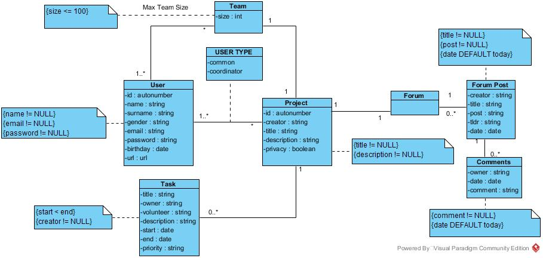

# A4: Conceptual Data Model
 
## 1. Class diagram
 
> UML class diagram containing the classes, associations, multiplicity and roles.
> For each class, the attributes, associations and constraints are included in the class diagram

## 2. Additional Business Rules
> To the Buisiness Rules presented in the secound report we sould like to add:

Identifier|Name|Description 
----------|----|-----------
BR05|Good Password|Passwords need to be 8 characters long and contain a capital letter and a number
BR06|Name Checking|User's Names and Surnames can't contain letters
BR07|Project Name|A Project can't have the same name as another project already in the database

***
 
GROUP1767, xx/xx/2018
 
> Carla Cristine Alvarenga Ferrarez de Castro, up201710786@fe.up.pt

> Gabriel Francisco Machado, up201711002@fe.up.pt

> João Carlos Fonseca Pina de Lemos, ee10201@fe.up.pt

> Luis Guilherme da Costa Castro Neves, up201306485@fe.up.pt
