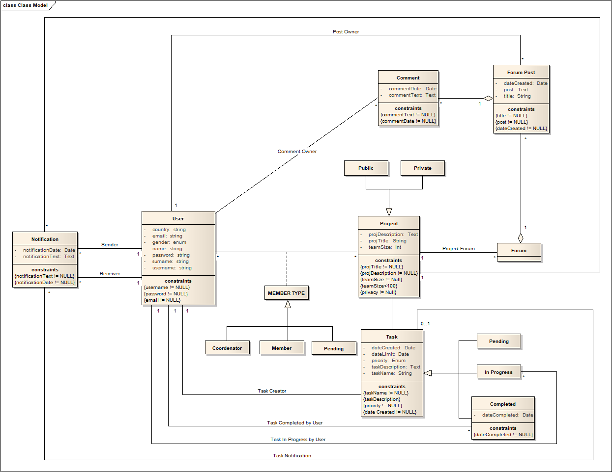

# A4: Conceptual Data Model
 
## 1. Class diagram

## 2. Additional Business Rules
> To the Buisiness Rules presented in the second report we would like to add:

Identifier|Name|Description 
----------|----|-----------
BR05|Good Password|Passwords need to be 8 characters long and contain a capital letter and a number
BR06|Name Checking|User's Names and Surnames can't contain numbers
BR07|Project Name|A Project can't have the same name as another project already in the database
BR08|Coordinator Heritage|A Project's Coordinator can't leave a project if he is the only Coordinator in said Project, a Common Users has to be promoted first

***
<!--
[comment]: <> (Estes comentários não aparecem na vizualização do ficheiro)
[comment]: <> (Para a criação do UML usei o programa visual paradigm https://www.visual-paradigm.com/)
[comment]: <> (A numenclatura que usei para restrições é diferento da do exemplo do prof mas também está correcta)
-->
 
GROUP1767, xx/xx/2018
 
> Carla Cristine Alvarenga Ferrarez de Castro, up201710786@fe.up.pt

> Gabriel Francisco Machado, up201711002@fe.up.pt

> João Carlos Fonseca Pina de Lemos, ee10201@fe.up.pt

> Luis Guilherme da Costa Castro Neves, up201306485@fe.up.pt
